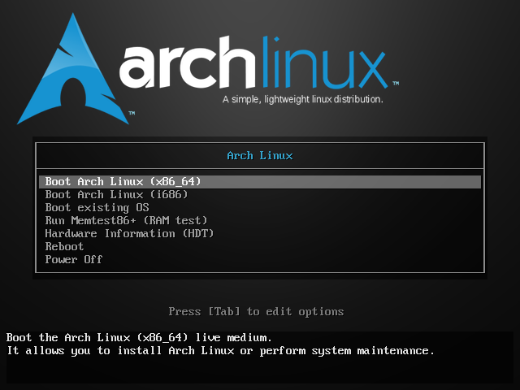

# Arch linux installation guide

## Table of contents

1. [Booting Live CD/USB](#booting)
2. [Setting czech environment parameters](#czkeyboard)
3. [Disc preparation](#discprepare)

Jedem

Jedem

Jedem

Jedem

Jedem

Jedem

Jedem

Jedem

Jedem

Jedem

Jedem

Jedem

Jedem

Jedem

Jedem

Jedem

Jedem

Jedem

Jedem

Jedem

Jedem

## Booting Live CD/USB <a name="booting"></a>



Boot into **arch** (probably *x86_64* version).

## Setting czech environment parameters<a name="czkeyboard"></a>

```bash
loadkeys cz-qwertz
setfont Lat2-Terminus16
```

## Disc preparation <a name="discprepare"></a>

```bash
lsblk
cfdisk /dev/sda
cfdisk /dev/sdb
cfdisk /dev/sdc
mkfs.ext4 /dev/sda1
mkfs.ext4 /dev/sdc1
mkswap /dev/sdb1
swapon /dev/sdb1
lsblk /dev/sda
lsblk /dev/sdb
lsblk /dev/sdc
mount /dev/sda1 /mnt
mkdir /mnt/home
mount /dev/sdc1 /mnt/home
```

Use **timedatectl** to ensure the system clock is accurate:
```bash
timedatectl set-ntp true
```

===

===
Then use command

```bash
nano /etc/locale.gen
```

to edit locales -> uncomment following two lines, save file (Ctrl+O) and exit editor (Ctrl+X):

```bash
cs_CZ.UTF-8 UTF-8
cs_CZ.ISO-8859-2
```

	locale-gen
	export LANG=cs_CZ.UTF-8

## Test2

# TEST3

## PACMAN optimalisation

```bash
pacman-optimize && sync
```

or

```bash
rankmirrors -n 10 /etc/pacman.d/mirrorlist.pacnew > /etc/pacman.d/mirrorlist
```
